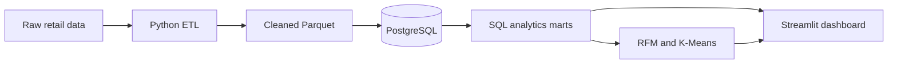

<!--
  GitHub PROFILE README for https://github.com/Vu-Viet-Phong
  Place in the public repository: Vu-Viet-Phong/Vu-Viet-Phong
  This is NOT the README for nexora-commerce-ai.
-->

<div align="center">


<br />

<a href="https://github.com/Vu-Viet-Phong/nexora-commerce-ai"></a>
<a href="https://github.com/Vu-Viet-Phong?tab=repositories"></a>

</div>

---

### `> about_me`

```yaml
name: Vu Viet Phong
education: Final-year undergraduate student | International University
location: Vietnam
career_goal: Aspiring Data Scientist
interests:
  - Statistics & data analysis
  - Machine learning & recommendation systems
  - Building end-to-end data projects
currently_building: Nexora Commerce AI
approach: "Learn the fundamentals. Build. Evaluate. Improve."
```

I'm a **final-year undergraduate student** interested in **Statistics, Data Science, and Machine Learning**. I learn through hands-on projects: exploring data, building pipelines, working with SQL, testing models, and turning results into something useful.

I'm still growing my skills and documenting what I learn along the way. My goal is to develop into a Data Scientist who can **explain the methodology, validate the results, and build reproducible solutions**.

---

### `01 / FEATURED BUILD` — Nexora Commerce AI

> **A hands-on e-commerce intelligence project:** from messy retail transactions to analytics, customer segmentation, and a working dashboard.

<div align="center">

<a href="https://github.com/Vu-Viet-Phong/nexora-commerce-ai"></a>


</div>

**What I've built so far**

| Area | Implementation |
| :-- | :-- |
| **Data engineering** | Ingestion, cleaning, validation, and Parquet datasets |
| **SQL & data quality** | PostgreSQL relational model, analytics marts, reconciliation checks |
| **Customer analytics** | Exploratory analysis, RFM features and customer segmentation |
| **Machine learning** | Reproducible K-Means baseline and cluster profiling |
| **Visualization** | Streamlit dashboard for sales, customers, and RFM insights |

**Project workflow**



<div align="center">

**[Explore Nexora Commerce AI →](https://github.com/Vu-Viet-Phong/nexora-commerce-ai)**

<sub>Ongoing learning project · Implemented features are not a claim of production deployment.</sub>

</div>

---

### `02 / TOOLBOX` — Technologies I use and learn

<div align="center">

**Data & Programming**


<br />
<br />


</div>

---

### `03 / LEARNING PATH` — What's next?

```text
[ BUILT ]  Data pipelines, PostgreSQL marts and data quality
[ BUILT ]  Customer analytics, RFM and K-Means baseline
[ BUILT ]  Streamlit analytics dashboard MVP
[ NEXT  ]  Churn and repeat-purchase prediction
[ LATER ]  Forecasting, recommendation systems and deployment
```

> I care more about **understanding why a solution works** than collecting buzzwords. Each project is a chance to improve my fundamentals, coding practices, and communication.

---

<div align="center">

### Thanks for visiting!

**Learning consistently. Building one meaningful project at a time.**

<a href="https://github.com/Vu-Viet-Phong?tab=repositories"></a>
<a href="https://github.com/Vu-Viet-Phong/nexora-commerce-ai"></a>


</div>
