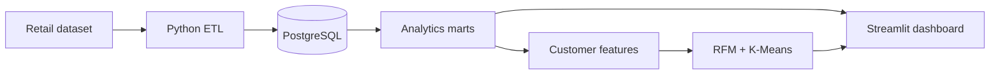

<!--
  GITHUB PROFILE README — Vu-Viet-Phong
  Publish this file as: https://github.com/Vu-Viet-Phong/Vu-Viet-Phong/blob/main/README.md
  Do NOT replace the README inside nexora-commerce-ai with this file.
-->

<div align="center">


<a href="https://github.com/Vu-Viet-Phong">
  
</a>

<br />

<a href="https://github.com/Vu-Viet-Phong?tab=repositories"></a>
<a href="https://github.com/Vu-Viet-Phong/nexora-commerce-ai"></a>


</div>

---

### `> whoami`

```yaml
name: Vu Viet Phong
location: Vietnam
education: Third-year student | International University
passion: Statistics, Data Science & Artificial Intelligence
focus:
  - End-to-end data engineering
  - Machine learning & recommendation systems
  - Turning prototypes into usable data products
currently_building: Nexora Commerce AI
mindset: "Don't just train models. Build systems that matter."
```

I'm a student and builder who enjoys working across the **full data journey**: understanding messy datasets, engineering reliable pipelines, designing useful metrics, training interpretable models, and putting the results into applications people can use.

My current interests include **data science, recommendation systems, multimodal learning, and AI-powered commerce**. I'm learning in public, one meaningful project at a time.

---

### `01 / THE BUILD` — Featured project

<table>
<tr>
<td width="100%" valign="top">

<h3><a href="https://github.com/Vu-Viet-Phong/nexora-commerce-ai">NEXORA COMMERCE AI</a> <sub>— flagship project</sub></h3>

<p><strong>From retail transactions to an end-to-end commerce intelligence system.</strong></p>

<p>


</p>

<p>Raw retail data → validated Parquet → PostgreSQL → analytics marts → customer features → RFM / K-Means → interactive dashboard.</p>

<p><strong>Highlights</strong>: data ingestion and quality checks, relational modeling, SQL metrics, customer segmentation, repeatable experiments, and a Streamlit analytics MVP.</p>

<p><a href="https://github.com/Vu-Viet-Phong/nexora-commerce-ai"><strong>Explore source code and documentation →</strong></a></p>

</td>
</tr>
</table>

**Inside the pipeline:**



<div align="center">
<a href="https://github.com/Vu-Viet-Phong?tab=repositories"><strong>See all repositories ↗</strong></a>
</div>

---

### `02 / THE ARSENAL` — Tech stack

<div align="center">

**Languages & Databases**


<br />
<br />

**Data, Machine Learning & Apps**


<br />
<br />

**Workflow & Tools**


</div>

---

### `03 / CURRENT QUESTS` — What I'm exploring

| Track | What I'm working toward |
|:--|:--|
| **Data Engineering** | Reproducible ETL, data quality, SQL analytics and reliable pipelines |
| **Machine Learning** | RFM, clustering, recommendation systems and model evaluation |
| **AI Commerce** | Customer intelligence, churn modeling and decision support |
| **Real-world Software** | Turning notebooks into maintainable applications and dashboards |

> **My philosophy:** The most interesting model is the one you can explain, reproduce, and actually use.

---

### `04 / SIGNAL` — GitHub activity

<div align="center">


<br />


<sub>Live cards are generated by third-party services and may occasionally be unavailable.</sub>

</div>

---

### `05 / NEXT LEVEL` — Roadmap

```text
[ COMPLETE ]  Data pipelines + PostgreSQL analytics
[ COMPLETE ]  RFM / K-Means customer segmentation
[ COMPLETE ]  Streamlit analytics dashboard MVP
[ NEXT     ]  Churn prediction + repeat-purchase modeling
[ PLANNED  ]  Forecasting, recommenders & intelligent APIs
```

<div align="center">

### Let's turn ideas into working systems.

<a href="https://github.com/Vu-Viet-Phong"></a>
<a href="https://github.com/Vu-Viet-Phong/nexora-commerce-ai"></a>


</div>
