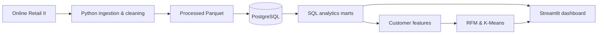

<!--
  GitHub Profile README — repository: Vu-Viet-Phong/Vu-Viet-Phong
  This file is for the PERSONAL PROFILE, not nexora-commerce-ai.
  Dynamic cards are third-party images and may occasionally be rate limited.
-->

<div align="center">


<br />

<a href="https://github.com/Vu-Viet-Phong/nexora-commerce-ai"></a>
<a href="https://github.com/Vu-Viet-Phong?tab=repositories"></a>

<sub>Learning in public • Focused on fundamentals • One meaningful project at a time</sub>

</div>

---

### `00 / WHOAMI` — A little about me

```yaml
name: Vu Viet Phong
education: Final-year undergraduate | International University
location: Vietnam
direction: Aspiring Data Scientist
interests:
  - Statistics & exploratory data analysis
  - Machine learning & recommendation systems
  - Data pipelines, SQL & reproducible experiments
current_project: Nexora Commerce AI
mindset: "Learn the fundamentals. Build. Evaluate. Improve."
```

I'm a **final-year undergraduate student** interested in **Statistics, Data Science, and Machine Learning**. I enjoy working through the full data workflow — exploring messy datasets, designing reproducible pipelines, validating results, and presenting insights clearly.

I'm **learning through practical projects** and documenting what I build, how I evaluate it, and what I still want to improve.

---

### `01 / FEATURED PROJECT` — Nexora Commerce AI

> **From raw retail transactions to customer intelligence.** A hands-on end-to-end project covering data processing, PostgreSQL analytics, customer segmentation, and interactive reporting.

<div align="center">

<a href="https://github.com/Vu-Viet-Phong/nexora-commerce-ai"></a>

<br />


</div>

| Layer | What I've implemented in the project |
| :--- | :--- |
| **Data Engineering** | Data ingestion, cleaning, Parquet outputs, validation and audit trail |
| **Database & SQL** | PostgreSQL relational core, analytical marts and financial reconciliation |
| **Data Quality** | Automated integrity checks and isolated database test workflows |
| **Customer Analytics** | Feature engineering, exploratory analysis, RFM segmentation |
| **Machine Learning** | K-Means baseline, cluster profiling and evaluation |
| **Visualization** | Streamlit MVP with sales, customer and RFM insights |

<details>
<summary><b>Explore the project architecture</b></summary>
<br />



</details>

<div align="center">

**[Explore the Nexora repository →](https://github.com/Vu-Viet-Phong/nexora-commerce-ai)**

<sub>Learning project • Implemented components do not imply public production deployment</sub>

</div>

---

### `02 / TOOLBOX` — Technologies I'm using & learning

<div align="center">


<br /><br />


</div>

---

### `03 / SIGNAL` — GitHub activity

<div align="center">

<!-- Rank is intentionally hidden: a third-party grade is not a measure of technical ability. -->
<a href="https://github.com/Vu-Viet-Phong?tab=overview"></a>
<a href="https://github.com/Vu-Viet-Phong?tab=repositories"></a>

<br />

<!-- Different provider from the previously broken github-readme-activity-graph image. -->
<a href="https://github.com/Vu-Viet-Phong?tab=overview"></a>

<br />

<sub>Live cards are generated by third-party services and may occasionally be unavailable. If a card fails to load, <a href="https://github.com/Vu-Viet-Phong?tab=overview">view the native GitHub contribution calendar →</a></sub>

<sub>Language proportions reflect public repository code, not overall proficiency.</sub>

</div>

---

### `04 / NEXT LEVEL` — Learning roadmap

```text
[ BUILT    ]  Data pipelines, PostgreSQL marts and quality checks
[ BUILT    ]  Customer analytics, RFM and K-Means baseline
[ BUILT    ]  Streamlit sales / customer dashboard MVP
[ LEARNING ]  Churn & repeat-purchase prediction
[ LATER    ]  Forecasting, recommendation systems and deployment
```

> **My approach:** Understand the problem. Build a baseline. Validate the result. Explain what I learned.

---

<div align="center">

### Thanks for stopping by!

**Learning consistently. Building one meaningful project at a time.**

<a href="https://github.com/Vu-Viet-Phong?tab=repositories"></a>
<a href="https://github.com/Vu-Viet-Phong/nexora-commerce-ai"></a>


</div>
